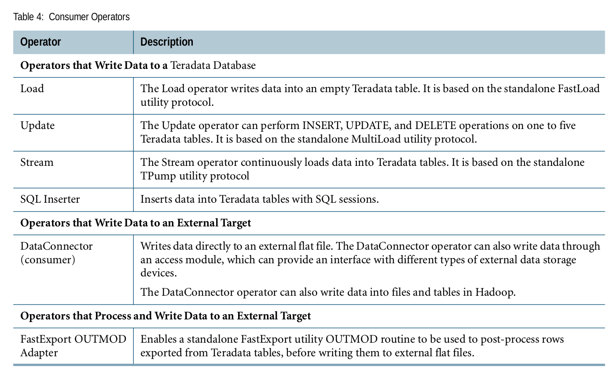
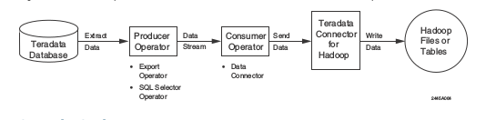

# Operadores Consumer
## Qué es
Creo que es  en un poco intuitiva la definicón de este operador, este operador consume datos del stream de datos para escribirlos ya sea a TERADATA o un destino externo, como un archivo plano o HDFS.
## Tipos de operadores Consumer
En  imagen se pueden apreciar los diferentes tipos d e operadores consumer.

## Extracción de datos y enviarlos directamente a HDFS
* Para este job el flujo sería el siguiente:

## Configuración de HDFS en máquina virtual.

* Primero tenemos que intercambiar  llaves ssh
```
ssh-keygen -t rsa
ssh-copy-id user@host
ssh-add
ssh user@host --> Cuando iniciemos sesión no se nos debe solicitar contraseña
```
* Editar core-site.xml
```XML
<configuration>
  <property>
      <name>fs.defaultFS</name>
      <value>hdfs://hostname:9000</value>
  </property>
  <property>
    <name>fs.default.name</name>
    <value>hdfs://hostname:8020</value>
  </property>
</configuration>
```
* Editar  yarn-site.xml
```XML
<configuration>
  <property>
    <name>yarn.nodemanager.aux-services</name>
    <value>mapreduce_shuffle</value>
  </property>
  <property>
    <name>yarn.resourcemanager.address</name>
    <value>hostname:8032</value>
  </property>
</configuration>
```
* Editar mapred-site.xml.template
```XML
<configuration>
  <property>
    <name>mapreduce.framework.name</name>
    <value>yarn</value>
  </property>
  <property>
      <name>mapreduce.jobtracker.address</name>
      <value>TDExpress16:9001</value>
</property>
</configuration>
```
